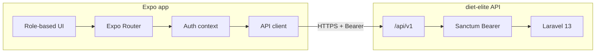

<p align="center">
  
</p>

<h1 align="center">Diet Elite — Mobile App</h1>

<p align="center">
  <strong>Cross-platform nutrition companion</strong><br />
  Expo · React Native · TypeScript · Same API as the web platform
</p>

<p align="center">
  <a href="https://github.com/PrasobhVarayalil/diet-elite-mobile"></a>
  <a href="https://github.com/PrasobhVarayalil/diet-elite"></a>
</p>

<p align="center">
  
  
  
  
  
  
</p>

---

## For interviewers

> **30-second pitch:** This is the mobile client for Diet Elite — an Expo React Native app that consumes the same Laravel `/api/v1` REST API as the web SPA. I built role-aware navigation (customer, dietitian, advisor, admin), secure token storage, and feature parity for plans, checkout, bookings, payments, messaging, and notifications — demonstrating API-first design and shared domain logic across web and mobile.

| What to see | Where |
|-------------|--------|
| **Backend + web** | [diet-elite](https://github.com/PrasobhVarayalil/diet-elite) — Laravel + React portals |
| **API docs** | [docs/API.md](https://github.com/PrasobhVarayalil/diet-elite/blob/main/docs/API.md) |
| **Interview guide** | [INTERVIEW-GUIDE.md](https://github.com/PrasobhVarayalil/diet-elite/blob/main/docs/INTERVIEW-GUIDE.md) |
| **Portfolio page** | Web app → `/portfolio` |

**Demo login** (API must have `php artisan db:seed-demo`):

| Field | Value |
|-------|--------|
| Email | `customer@dietelite.com` |
| Password | `password` |

Try other roles: `dietitian@`, `advisor@`, `admin@` @ `dietelite.com`

---

## Why this project stands out

| Area | What it demonstrates |
|------|----------------------|
| **API-first** | Single backend serves web SPA + mobile — no duplicated business rules |
| **Auth** | Sanctum Bearer tokens, `X-Client: mobile`, secure storage via `expo-secure-store` |
| **RBAC** | Dynamic tabs & menus per role — mirrors web `nav-config` |
| **Commerce** | Plan catalog, compare, checkout flow against live API pricing |
| **Messaging** | Customer ↔ staff threads with unread badges |
| **Ship-ready** | EAS Build profiles for Android APK / production |

---

## Architecture



---

## Features by role

### Customer
Home · Plans (list, detail, compare, checkout) · Bookings · Payments · Health profile · Meal plan · Messages · Notifications · AI coach · Reviews

### Dietitian
Appointments · Client list & detail · Schedule · Leave · Messages

### Advisor
Dashboard · Enrollments · Consult bookings · Messages

### Admin
Dashboard · Users · Plans & categories · Plan ranks · Bookings · Payments · Schedules · Audit log

---

## Quick start

### Prerequisites

- Node.js 20+
- [Expo Go](https://expo.dev/go) on your phone, or Android Studio / Xcode emulator
- Running **[diet-elite](https://github.com/PrasobhVarayalil/diet-elite)** API (local or Render)

### Setup

```bash
git clone https://github.com/PrasobhVarayalil/diet-elite-mobile.git
cd diet-elite-mobile
cp .env.example .env
npm install
```

Set `EXPO_PUBLIC_API_URL` in `.env`:

| Environment | API URL |
|-------------|---------|
| Android emulator | `http://10.0.2.2:8000` |
| iOS simulator | `http://localhost:8000` |
| Phone (same Wi‑Fi) | `http://YOUR_PC_IP:8000` |
| Render production | `https://your-service.onrender.com` |

### Run

```bash
npm start
```

Press **`a`** (Android), **`i`** (iOS), or scan the QR code with Expo Go.

```bash
npm run typecheck   # CI type check
npm run build:apk   # EAS preview APK
```

---

## Project structure

```
app/                    Expo Router screens (file-based routing)
  (app)/                Authenticated shell — tabs per role
  login.tsx             Auth entry
src/
  lib/                  API client, routes, role nav, formatters
  context/              Auth, unread messages & notifications
  types/                Shared TypeScript models
components/ui/          Reusable mobile UI (Button, Card, Screen…)
constants/theme.ts      Diet Elite brand palette (#227014)
```

---

## API integration

| Concern | Implementation |
|---------|----------------|
| Login | `POST /api/v1/auth/login` + `X-Client: mobile` |
| Session | `Authorization: Bearer {token}` on all requests |
| Me / roles | `GET /api/v1/auth/me` drives tab bar & menus |
| Errors | Typed API envelope + form error mapping |

Client: `src/lib/api-client.ts` · Routes: `src/lib/api-routes.ts`

---

## Branch workflow

Matches **diet-elite** backend:

```
feature/* → develop → staging → main
```

```powershell
.\scripts\promote-branches.ps1   # after QA on staging
```

Never merge `develop` directly into `main`.

---

## Related repositories

| Repo | Description |
|------|-------------|
| **[diet-elite-mobile](https://github.com/PrasobhVarayalil/diet-elite-mobile)** (this) | Expo mobile client |
| **[diet-elite](https://github.com/PrasobhVarayalil/diet-elite)** | Laravel API + React web app |

When adding a feature:
1. Extend API in **diet-elite** (`routes/api.php`)
2. Add screen here calling the same endpoint

---

## Roadmap

- [x] Customer plans, checkout, bookings, payments
- [x] Multi-role navigation (customer, dietitian, advisor, admin)
- [x] Notifications & messenger
- [ ] Razorpay native checkout (`react-native-razorpay` + EAS)
- [ ] App Store / Play Store release builds

---

## Author

**Prasobh Varayalil**

- GitHub: [@PrasobhVarayalil](https://github.com/PrasobhVarayalil)
- Mobile: [github.com/PrasobhVarayalil/diet-elite-mobile](https://github.com/PrasobhVarayalil/diet-elite-mobile)
- Web + API: [github.com/PrasobhVarayalil/diet-elite](https://github.com/PrasobhVarayalil/diet-elite)

---

<p align="center">
  <sub>Companion to Diet Elite web platform · API-first mobile engineering.</sub>
</p>
